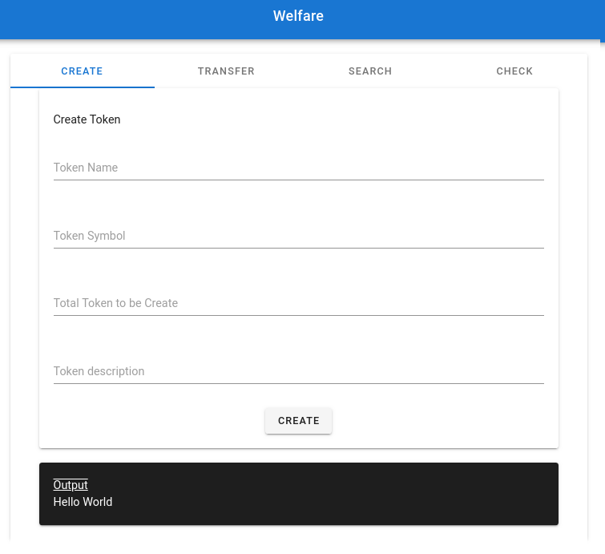

# 

## Welfare

## Problem Statement

- How do we improve the process flow between businesses and the government during a pandemic? Financial operations, especially during difficult times, are prone to having low transparency, limited traceability,  delays, required intermediaries, and extra costs. While leveraging blockchain Maxonrow FT/NFT, how can we eliminate intermediaries to lower transaction costs, take back control from financial intermediaries while providing transparency to beneficiaries of welfare programs?

## Example Solution

- A secured & transparent platform for the government to provide subsidy/relief to business
- A platform for government that automate data verification and reporting, facilitate regulatory oversight, reduce operational friction, and eliminate errors associated with manual auditing.

## Start Up Social Project

### Step 1 - Start up blockchain localnet

- Start localnet [here](https://github.com/maxonrow/maxathon/tree/master/blockchain-starter-kit)

### Step 2 - Clone project

- Clone project `$ git clone https://github.com/maxonrow/challenge-welfare.git`

### Step 3 - Navigate to path

- Go to path `cd challenge-welfare/welfare`

### Step 4 - Build & run service

- run `npm i` & subsequently with `sudo npm run serve` & your service should be up at `http://localhost:3001/`

### Step 5 - Expected output

